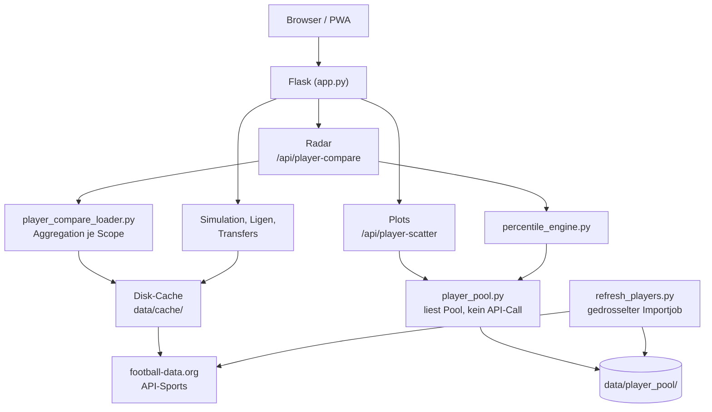

# FootSim

> Fußball-Simulation und -Analyse: Spiele simulieren, Ligen vergleichen, Spieler gegenüberstellen und in Streudiagrammen einordnen — auf Basis echter Saisondaten.

[]()
[]()
[]()

**Live:** [footsim.de](https://www.footsim.de)

---

## Inhalt

- [Über FootSim](#über-footsim)
- [Features](#features)
- [Der Spielerbereich](#der-spielerbereich)
- [Architektur](#architektur)
- [Player Pool und Importlogik](#player-pool-und-importlogik)
- [Caching](#caching)
- [API-Endpunkte](#api-endpunkte)
- [Projektstruktur](#projektstruktur)
- [Tech-Stack](#tech-stack)
- [Installation](#installation)
- [Player Pool befüllen](#player-pool-befüllen)
- [Datenquellen](#datenquellen)
- [PWA](#pwa)
- [Entwicklung](#entwicklung)
- [Champions-League-ML (Schattenbetrieb)](#champions-league-ml-schattenbetrieb)
- [Roadmap](#roadmap)
- [Lizenz](#lizenz)

---

## Über FootSim

FootSim vereint Monte-Carlo-Simulation, Ligavergleiche, Transferanalysen und
einen datenbasierten Spielervergleich in einer mobil-optimierten Anwendung.
Alle Werte stammen aus echten Saisondaten — keine geschätzten oder erfundenen
Kennzahlen. Fehlt ein Wert, wird das offen angezeigt statt mit einer Null
kaschiert.

Gebaut als PWA: installierbar auf dem Smartphone, Offline-Fallback für bereits
geladene Inhalte, native App-Anmutung auf Mobile.

## Features

| Bereich | Beschreibung | Status |
|---|---|---|
| **Spielsimulation** | Monte-Carlo-Simulation einzelner Partien mit Wahrscheinlichkeiten | ✅ |
| **Saisonsimulation** | Komplette Liga durchsimulieren, Meisterwahrscheinlichkeiten | ✅ |
| **Tabellen & Torjäger** | Aktuelle Tabellen und Torschützenlisten | ✅ |
| **Ligavergleich** | Bis zu fünf Ligen anhand realer Kennzahlen gegenüberstellen | ✅ |
| **Champions-League-Vergleich** | Ligen anhand ihrer CL-Performance vergleichen | ✅ |
| **Transfervergleich** | Sommertransfers zweier Quelligen in eine gemeinsame Zielliga | ✅ |
| **Spielervergleich – Radar** | Zwei Spieler positionsbasiert, mit Wettbewerbsumfang und Vergleichsrang | ✅ |
| **Spielervergleich – Plots** | Streudiagramm über hunderte Spieler, zwei frei wählbare Achsen | ✅ |
| **PDF Merge** | Werkzeug zum Zusammenführen von PDF-Dateien | ✅ |
| **PWA** | Installierbar, Offline-Fallback, Safe-Area-Unterstützung | ✅ |

## Der Spielerbereich

Der Spielerbereich beginnt mit einer Auswahl zwischen zwei Ansichten:

```
Bottom-Navigation "Spieler"
        │
        ├── Radar   → zwei Spieler im Detail vergleichen
        └── Plots   → viele Spieler auf zwei Kennzahlen einordnen
```

Beide Ansichten teilen sich Position, Saison und die gewählten Spieler.
Ein Wechsel verliert keine Einstellung.

### Wettbewerbsumfang

Radar und Plots verwenden dieselbe Wettbewerbslogik. Vier Modi:

| Modus | Enthält | Anmerkung |
|---|---|---|
| **Alle Vereinswettbewerbe** *(Standard)* | Liga, nationale Pokale, Champions/Europa/Conference League, Supercups | vollständigstes Saisonbild |
| Nur Liga | ausschließlich die nationale Liga | fairster Vergleich: gleiche Gegner, gleiche Anzahl Partien |
| Nur Nationalmannschaft | Länderspiele, WM, EM, Nations League | kleine Stichprobe, wird als solche gekennzeichnet |
| Alle Wettbewerbe | Verein + Nationalmannschaft | mischt sehr unterschiedliche Niveaus |

**Aggregation ist mathematisch korrekt umgesetzt:** Absolute Zähler werden
summiert, Per-90-Werte anschließend aus den summierten Rohwerten und der
Gesamtminutenzahl **neu berechnet** — nicht gemittelt. Quoten entstehen aus
Zähler und Nenner, nicht als Mittelwert einzelner Quoten. Ratings werden
minutengewichtet zusammengeführt.

### Radar

Positionsabhängige Achsen (Torwart, Abwehr, Mittelfeld, Angriff) oder ein
positionsübergreifendes Profil, wenn Spieler verschiedener Gruppen verglichen
werden. Das Radar verschwindet dabei nie — es wechselt nur die Achsen und
benennt den Modus deutlich.

Zusätzlich zum Rohwert zeigt jede Kennzahl einen **Vergleichsrang** gegenüber
einer Referenzgruppe (`87/100` = besser als 87 % der Vergleichsgruppe). Der
Fachbegriff „Perzentil" erscheint nur in Erklärtexten, nicht als
Hauptbotschaft.

### Plots

Ein Punkt = ein Spieler. Frei wählbare X- und Y-Achse aus 27 Kennzahlen,
Filter für Position, Wettbewerbsumfang, Ligen und Mindestminuten.

**Ablauf:**

```
Plots öffnen → X-Achse → Y-Achse → Datenbasis → Position
→ Ligen → Mindestminuten → [ Plot erstellen ] → Punktwolke
```

Der Plot entsteht über einen sichtbaren Primary-Button, nicht automatisch.
Grund: Jeder Request liest den kompletten Pool und aggregiert neu — bei sieben
Filtern würde Automatik Requests für Zwischenzustände auslösen, die niemand
sehen wollte. Außerdem bliebe unklar, ob das gezeigte Bild zu den aktuellen
Filtern gehört.

| Zustand | Button |
|---|---|
| noch kein Plot | **Plot erstellen**, aktiv |
| Plot da, Filter unverändert | *Plot aktualisieren*, deaktiviert |
| Plot da, Filter geändert | **Plot aktualisieren**, aktiv — alte Punktwolke wird sichtbar abgeblendet |
| lädt gerade | deaktiviert, `aria-busy` |

Ein Doppelklick erzeugt keinen zweiten Request; veraltete Antworten werden
über einen Request-Zähler entwertet.

**Das Diagramm** hat Raster, beschriftete Skalen, Achsenlabels und eine
Regressionslinie (erst ab 8 Punkten — darunter wäre sie statistisch
bedeutungslos). Ligen sind farbcodiert mit Legende.

**Punkte sind anklickbar.** Ein Klick öffnet eine Detailkarte mit Name,
Verein, Liga, Position, Alter, Einsatzminuten, beiden Achsenwerten und dem
verwendeten Wettbewerbsumfang. Sie schließt über den Schließen-Button, Klick
außerhalb oder Escape — nie automatisch nach Zeit. Auf Mobil wird sie zum
festen Sheet über der Bottom-Navigation.

Im Radar gewählte Spieler sind automatisch hervorgehoben — über Farbe **und**
weiße Kontur und Größe, nie über Farbe allein. Die zusätzliche Spielersuche
steht unterhalb des Plots, ist als optional gekennzeichnet und erzeugt keinen
neuen Request — sie markiert nur bereits geladene Punkte.

## Screenshots

| Ansicht | Beschreibung |
|---|---|
| *(folgt)* | Startseite mit Simulation |
| *(folgt)* | Radar-Vergleich zweier Spieler |
| *(folgt)* | Streudiagramm mit hervorgehobenen Spielern |
| *(folgt)* | Detailkarte eines Spielerpunkts |
| *(folgt)* | Mobile-Ansicht |

## Architektur



**Kernprinzip:** Jeder externe API-Aufruf wird gecacht, bevor er in eine
Berechnung einfließt. Der Player Pool wird ausschließlich über einen separaten
Importjob befüllt — nie innerhalb eines Nutzerrequests. Plots und Perzentile
lesen nur diesen Pool und lösen selbst **keinen einzigen API-Aufruf** aus.

## Player Pool und Importlogik

Der Player Pool ist ein persistenter Datensatz, **kein Cache**. Der
Unterschied ist wesentlich: Ein abgelaufener Cache lädt sich selbst nach —
beim Pool wären das 26–31 API-Requests pro Liga mitten im Nutzerrequest.
Deshalb löst ein veralteter Pool nichts aus; er gilt einfach als veraltet.

### Ein Pool, alle Wettbewerbsumfänge

Es gibt **einen** Pool pro Liga und Saison. Beim Import wird jeder Spieler
einmal abgerufen; aus derselben Rohantwort werden alle vier
Wettbewerbsumfänge berechnet und im Pooleintrag abgelegt:

```
data/player_pool/
├── status.json                Importstatus je Liga und Saison
├── pool_bl1_2025.json          Spieler mit Kennzahlen je Scope
├── pool_pl_2025.json
└── import.lock                 Schutz gegen parallele Importe
```

Keine separaten Pools je Modus — ein Wechsel des Wettbewerbsumfangs kostet
dadurch **null zusätzliche API-Requests**.

### Import

```bash
python refresh_players.py --report                  # Status, ohne Requests
python refresh_players.py --league bl1 --season 2025
python refresh_players.py --all --season 2025       # ~140 Requests, ca. 1 Minute
```

Der Import ist gedrosselt (0,5 s zwischen Requests), fortsetzbar nach Abbruch
und durch ein PID-Lockfile gegen Doppelstarts geschützt. Ein Lock, der älter
als zwei Stunden ist, gilt als verwaist und wird überschrieben.

> **Hinweis:** Wurde vor der Wettbewerbsumfang-Erweiterung bereits importiert,
> ist ein einmaliger Neuimport nötig — der alte Pool kennt nur Ligadaten.
> `--report` weist darauf hin.

## Caching

| Ebene | Ort | Gültigkeit |
|---|---|---|
| API-Antworten (Ligen, Tabellen, Spieler) | `data/cache/` | je Endpunkt, abgeschlossene Saisons 1 Jahr |
| Spielerprofil (rohe API-Antwort, alle Wettbewerbe) | `data/cache/` | 1 Jahr / 24 h bei laufender Saison |
| Suchergebnisse | `data/cache/` | 6 Stunden |
| Scatter-Punktlisten | `data/cache/` | 1 Stunde, Schlüssel aus allen Filtern inkl. Scope |
| Player Pool | `data/player_pool/` | persistent, nur durch Import erneuert |

Der Cache ist dateibasiert und damit **workerübergreifend** — bei mehreren
Gunicorn-Workern teilen sich alle Prozesse dieselben Daten.

## API-Endpunkte

| Endpunkt | Zweck | API-Requests |
|---|---|---|
| `GET /api/player-seasons` | wählbare Saisons, Ligen, Mindestlänge der Suche | keine |
| `GET /api/player-search` | Namenssuche ab 3 Zeichen | 5 (je Liga), 6 h gecacht |
| `GET /api/player-compare` | Radar-Vergleich zweier Spieler | 2, danach gecacht |
| `GET /api/player-scatter` | Punkte **und** alle Metadaten in einer Antwort | **keine** |

`/api/player-scatter` akzeptiert `x`, `y`, `position`, `leagues`, `season`,
`min_minutes` und `scope`. Die Antwort enthält zusätzlich den vollständigen
Achsenkatalog, alle Ligen, Positionen, Wettbewerbsumfänge sowie den
Poolstatus — bewusst kein separater Metadaten-Endpunkt, weil das Frontend
beides für denselben Render-Schritt braucht.

## Projektstruktur

```
footsim/
├── app.py                       Flask-Routen, HTTP-Schicht
├── refresh_players.py           Gedrosselter Importjob für den Player Pool
├── src/
│   ├── api/
│   │   ├── apisports_api.py      API-Sports-Client
│   │   └── league_api.py         football-data.org-Client
│   ├── data/
│   │   ├── player_metrics.py     Metrikkatalog, Positionsgruppen, Per-90-Logik
│   │   ├── player_compare_loader.py  Scope-Aggregation, Suche, Vergleichsaufbau
│   │   ├── player_pool.py        Pool-Speicherung, Import, Scatter-Zugriff
│   │   ├── percentile_engine.py  Verteilungen und Vergleichsrang
│   │   └── transfer_loader.py    Transfervergleich
│   ├── features/                 Fachliche Berechnungen
│   ├── predict/                  Monte-Carlo-Simulation
│   └── utils/disk_cache.py       Workerübergreifender Dateicache
├── static/
│   ├── script.js                 Gesamte Frontend-Logik (Vanilla JS)
│   └── style.css                 Gesamtes Styling
├── templates/                    Jinja2-Templates
├── tests/                        299 automatisierte Tests
└── docs/player_comparison.md     Architekturdokumentation des Spielerbereichs
```

## Tech-Stack

| Bereich | Technologie |
|---|---|
| Backend | Python 3.9+, Flask, Gunicorn |
| Database | PostgreSQL, SQLite (local), UUIDv7 |
| ORM | SQLAlchemy, Flask-Migrate, Alembic |
| Frontend | Vanilla JavaScript, kein Framework |
| Darstellung | SVG (Radar und Streudiagramme) |
| Daten | football-data.org, API-Sports |
| Caching | Dateibasiert, workerübergreifend |
| Deployment | VPS, nginx, systemd |
| PWA | Service Worker, Web App Manifest |

## Installation

```bash
git clone https://github.com/eliemengi/footsim.git
cd footsim
python -m venv .venv
source .venv/bin/activate         # Windows: .venv\Scripts\Activate.ps1
pip install -r requirements.txt
```

`.env` im Projektverzeichnis anlegen:

```env
FOOTBALL_API_KEY=dein_football-data.org_key
APISPORTS_KEY=dein_api-sports_key
```

Tests und Start:

```bash
pytest tests/ -q
python app.py
```

Die Anwendung läuft danach unter `http://127.0.0.1:5000`.

## Player Pool befüllen

Radar-Vergleiche funktionieren sofort. **Vergleichsrang und Plots brauchen den
Pool** — ohne ihn zeigt FootSim ehrliche Rohwerte mit einem entsprechenden
Hinweis statt erfundener Werte.

```bash
python refresh_players.py --report
python refresh_players.py --all --season 2025
```

Auf dem Server:

```bash
cd /root/footsim
venv/bin/python refresh_players.py --all --season 2025
```

Der Import kostet etwa 140 API-Requests und dauert rund eine Minute.
Abgeschlossene Saisons müssen nur einmal geladen werden.

## Datenquellen

- **[football-data.org](https://www.football-data.org)** — Ligastruktur, Tabellen, Spielpläne
- **[API-Sports](https://www.api-football.com)** — Spielerstatistiken, Transfers

Beide APIs werden ausschließlich serverseitig angesprochen. Kein API-Key im
Frontend.

### Bekannte Grenzen der Datenquellen

Kennzahlen, die diese Quellen nicht liefern — etwa xG, xA, progressive Pässe,
PPDA oder Trackingdaten — existieren in FootSim **nicht** und werden auch nicht
geschätzt.

Weitere Einschränkungen, die bewusst nicht kaschiert werden:

- **Positionen** liefert API-Sports nur in vier Gruppen (Torhüter, Abwehr,
  Mittelfeld, Angriff). Feinere Rollen wie Innenverteidiger oder Sechser wären
  geraten, nicht gemessen — deshalb gibt es sie nicht.
- **`passes.accuracy`** kommt je nach Liga als Prozentwert oder als absolute
  Passanzahl. Werte außerhalb 0–100 werden verworfen statt als falsche Quote
  angezeigt.
- **Die Liga-Seitenabfrage** des Importjobs liefert teils nur den ligaeigenen
  Statistikblock. Dann sind „Alle Vereinswettbewerbe" und „Nur Liga" identisch —
  das ist korrekt und wird nicht künstlich aufgebauscht.
- **Fehlende Werte** bleiben leer und werden nie zu 0. Ein Spieler ohne
  Dribbelversuche hat keine Dribbelquote von 0 %, sondern gar keine.

## PWA

Installierbar über „Zum Startbildschirm hinzufügen". Updates kommen beim
nächsten Start automatisch, bedingt durch das Service-Worker-Lifecycle
gelegentlich erst beim übernächsten.

## Entwicklung

```bash
pytest tests/ -q                          # alle 299 Tests
pytest tests/test_player_scatter.py -v    # gezielt ein Modul
```

Architekturentscheidungen werden direkt bei der Umsetzung dokumentiert, nicht
nachträglich — siehe [`docs/player_comparison.md`](docs/player_comparison.md)
für den vollständigen Spielerbereich inklusive Aggregationsregeln,
Perzentillogik und Scatter-Architektur.

## Champions-League-ML (Schattenbetrieb)

FootSims Prognose beruht auf einem Poisson-Modell über Teamstärkeprofile.
Ergänzend existiert eine trainierte ML-Korrektur für die Champions League.
Sie ist **standardmäßig ausgeschaltet** und verändert ohne ausdrückliche
Konfiguration keine einzige Zahl.

### Was gebaut ist

| Schritt | Inhalt |
| --- | --- |
| Datensatz | Point-in-Time-Zeilen aus fünf Ligen (2023–2025) plus 503 Champions-League-Partien, streng ohne Zukunftswissen |
| Backtest | Training auf nationalen Ligaspielen, Test auf 213 CL-Partien, Walk-forward mit gepaartem Bootstrap |
| Modell | Versioniertes JSON-Bundle mit SHA-256-Integritätswert, 16 Teamprofilmerkmale |
| Inference | Laufzeitschicht mit strengem Loader und sicherem Rückfall auf die Baseline |
| Gewichtung | Multiplikative Mischung zwischen Baseline und ML-Korrektur |
| Integration | Eine Anbindungsstelle für Einzelspiel- und Saisonsimulation |

### Das Messergebnis ist INCONCLUSIVE

Der Backtest gegen echte Champions-League-Partien ergab:

```
Baseline  LogLoss 0.92977
ML        LogLoss 0.92087
delta            -0.00890     95-%-Intervall [-0.02986, +0.01135]
```

Der Punktschätzer ist besser, das Konfidenzintervall enthält aber die Null.
Über 213 Spiele lässt sich damit **nicht belegen**, dass das Modell in der
Champions League besser prognostiziert als die bestehende Berechnung. Beide
Testfolds zeigten in dieselbe Richtung und die Kalibrierung verbesserte sich
deutlich (0.048 → 0.016) — das sind Hinweise, kein Nachweis.

Deshalb ist der Standard `off`, und die Aktivierung ist eine bewusste
Entscheidung des Betreibers, keine Empfehlung.

### Betriebsarten

Gesteuert über zwei Umgebungsvariablen, dokumentiert in
[`.env.example`](.env.example):

```bash
FOOTSIM_ML_MODE=off      # off | shadow | active
FOOTSIM_ML_WEIGHT=0.0    # 0.0 bis 1.0, nur in active wirksam
```

- **`off`** — Standard. Ausschließlich die bestehende Baseline. Es wird kein
  Modell geladen und keine ML-Funktion aufgerufen.
- **`shadow`** — Das Modell rechnet mit, die Diagnose steht in der
  API-Antwort, die Simulation benutzt weiterhin die Baseline.
- **`active`** — Die Simulation verwendet die gewichteten Werte, aber nur
  wenn Modell, Merkmale und Gewichtung alle getragen haben.

Das Gewicht läuft von `0.0` (reine Baseline) über `0.5` (geometrische
Mischung) bis `1.0` (volle Korrektur). Eine Prozentangabe wie `50` wird
**nicht** als `0.5` gedeutet, sondern abgewiesen — ein Tippfehler soll
auffallen und nicht still die volle Korrektur einschalten.

### Sichere Rückfälle

Bei jedem Problem rechnet die Simulation mit der unveränderten Baseline und
liefert ein gültiges Ergebnis: fehlendes oder beschädigtes Modell, fehlende
Teamprofile, ungültiges Gewicht, Mannschaft ohne Historie, unerwarteter
Fehler in der ML-Kette. Der Grund steht maschinenlesbar im Feld `ml` der
Antwort.

Die nationalen Ligen und alle Nicht-CL-Wettbewerbe sind von der ML-Kette
vollständig unberührt.

### Lokal ausprobieren

```bash
# Datensatz mit Champions-League-Zeilen bauen
py run_ml.py --build-dataset --include-cl --output data/ml/dataset_with_cl.json

# Shadow-Backtest gegen echte CL-Partien
py run_ml.py --evaluate-cl --output data/ml/cl_shadow_backtest.json

# Modell trainieren und versioniert speichern
py run_ml.py --train-cl-model --dataset data/ml/dataset_with_cl.json \
             --model-output data/ml/models/cl_shadow_model_v1.json

# Tests der gesamten ML-Kette
python -m pytest tests/test_ml_*.py -q
```

Ein sichtbarer Regler in der Oberfläche und die abschließende Entscheidung
über eine Aktivierung sind **noch nicht** umgesetzt.


## Roadmap

- [ ] Unterpositionen (IV/AV/DM/ZOM/Flügel/Mittelstürmer), sobald eine belastbare Datenquelle vorliegt — Einstiegspunkt ist vorbereitet
- [ ] Vereins-Streudiagramme (Datengrundlage liegt bereits im Pool)
- [ ] Asymmetrischer Expertenvergleich im Radar (unterschiedlicher Wettbewerbsumfang je Spieler)
- [ ] Vollständiger heller Modus
- [ ] Mehrsprachigkeit (Deutsch/Englisch)
- [ ] Sichtbarer ML-Regler und Entscheidung über eine Aktivierung — erst sinnvoll, wenn der Champions-League-Backtest die Übertragung belegt

## Lizenz

Siehe [`LICENSE`](LICENSE).
