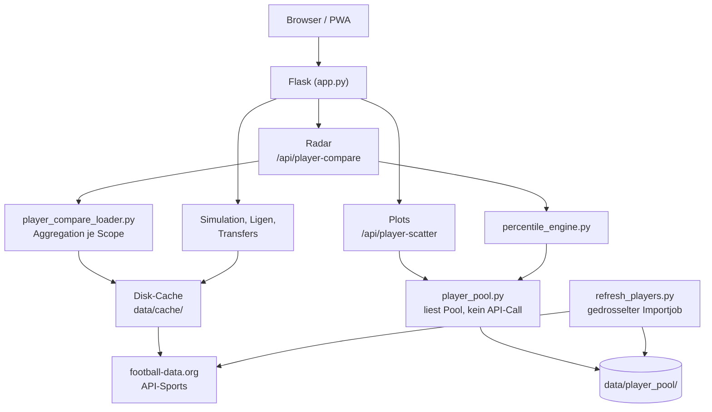

# FootSim

> Fußball-Simulation und -Analyse: Spiele simulieren, Ligen vergleichen, Spieler gegenüberstellen und in Streudiagrammen einordnen — auf Basis echter Saisondaten.

[]()
[]()
[]()

**Live:** [footsim.de](https://www.footsim.de)

---

## Inhalt

- [Über FootSim](#über-footsim)
- [Features](#features)
- [Der Spielerbereich](#der-spielerbereich)
- [Architektur](#architektur)
- [Player Pool und Importlogik](#player-pool-und-importlogik)
- [Caching](#caching)
- [API-Endpunkte](#api-endpunkte)
- [Projektstruktur](#projektstruktur)
- [Tech-Stack](#tech-stack)
- [Installation](#installation)
- [Player Pool befüllen](#player-pool-befüllen)
- [Datenquellen](#datenquellen)
- [PWA](#pwa)
- [Entwicklung](#entwicklung)
- [Champions-League-ML (Schattenbetrieb)](#champions-league-ml-schattenbetrieb)
- [Roadmap](#roadmap)
- [Lizenz](#lizenz)

---

## Über FootSim

FootSim vereint Monte-Carlo-Simulation, Ligavergleiche, Transferanalysen und
einen datenbasierten Spielervergleich in einer mobil-optimierten Anwendung.
Alle Werte stammen aus echten Saisondaten — keine geschätzten oder erfundenen
Kennzahlen. Fehlt ein Wert, wird das offen angezeigt statt mit einer Null
kaschiert.

Gebaut als PWA: installierbar auf dem Smartphone, Offline-Fallback für bereits
geladene Inhalte, native App-Anmutung auf Mobile.

## Features

| Bereich | Beschreibung | Status |
|---|---|---|
| **Spielsimulation** | Monte-Carlo-Simulation einzelner Partien mit Wahrscheinlichkeiten | ✅ |
| **Saisonsimulation** | Komplette Liga durchsimulieren, Meisterwahrscheinlichkeiten | ✅ |
| **Tabellen & Torjäger** | Aktuelle Tabellen und Torschützenlisten | ✅ |
| **Ligavergleich** | Bis zu fünf Ligen anhand realer Kennzahlen gegenüberstellen | ✅ |
| **Champions-League-Vergleich** | Ligen anhand ihrer CL-Performance vergleichen | ✅ |
| **Transfervergleich** | Sommertransfers zweier Quelligen in eine gemeinsame Zielliga | ✅ |
| **Spielervergleich – Radar** | Zwei Spieler positionsbasiert, mit Wettbewerbsumfang und Vergleichsrang | ✅ |
| **Spielervergleich – Plots** | Streudiagramm über hunderte Spieler, zwei frei wählbare Achsen | ✅ |
| **PDF Merge** | Werkzeug zum Zusammenführen von PDF-Dateien | ✅ |
| **PWA** | Installierbar, Offline-Fallback, Safe-Area-Unterstützung | ✅ |

## Der Spielerbereich

Der Spielerbereich beginnt mit einer Auswahl zwischen zwei Ansichten:

```
Bottom-Navigation "Spieler"
        │
        ├── Radar   → zwei Spieler im Detail vergleichen
        └── Plots   → viele Spieler auf zwei Kennzahlen einordnen
```

Beide Ansichten teilen sich Position, Saison und die gewählten Spieler.
Ein Wechsel verliert keine Einstellung.

### Wettbewerbsumfang

Radar und Plots verwenden dieselbe Wettbewerbslogik. Vier Modi:

| Modus | Enthält | Anmerkung |
|---|---|---|
| **Alle Vereinswettbewerbe** *(Standard)* | Liga, nationale Pokale, Champions/Europa/Conference League, Supercups | vollständigstes Saisonbild |
| Nur Liga | ausschließlich die nationale Liga | fairster Vergleich: gleiche Gegner, gleiche Anzahl Partien |
| Nur Nationalmannschaft | Länderspiele, WM, EM, Nations League | kleine Stichprobe, wird als solche gekennzeichnet |
| Alle Wettbewerbe | Verein + Nationalmannschaft | mischt sehr unterschiedliche Niveaus |

**Aggregation ist mathematisch korrekt umgesetzt:** Absolute Zähler werden
summiert, Per-90-Werte anschließend aus den summierten Rohwerten und der
Gesamtminutenzahl **neu berechnet** — nicht gemittelt. Quoten entstehen aus
Zähler und Nenner, nicht als Mittelwert einzelner Quoten. Ratings werden
minutengewichtet zusammengeführt.

### Radar

Positionsabhängige Achsen (Torwart, Abwehr, Mittelfeld, Angriff) oder ein
positionsübergreifendes Profil, wenn Spieler verschiedener Gruppen verglichen
werden. Das Radar verschwindet dabei nie — es wechselt nur die Achsen und
benennt den Modus deutlich.

Zusätzlich zum Rohwert zeigt jede Kennzahl einen **Vergleichsrang** gegenüber
einer Referenzgruppe (`87/100` = besser als 87 % der Vergleichsgruppe). Der
Fachbegriff „Perzentil" erscheint nur in Erklärtexten, nicht als
Hauptbotschaft.

### Plots

Ein Punkt = ein Spieler. Frei wählbare X- und Y-Achse aus 27 Kennzahlen,
Filter für Position, Wettbewerbsumfang, Ligen und Mindestminuten.

**Ablauf:**

```
Plots öffnen → X-Achse → Y-Achse → Datenbasis → Position
→ Ligen → Mindestminuten → [ Plot erstellen ] → Punktwolke
```

Der Plot entsteht über einen sichtbaren Primary-Button, nicht automatisch.
Grund: Jeder Request liest den kompletten Pool und aggregiert neu — bei sieben
Filtern würde Automatik Requests für Zwischenzustände auslösen, die niemand
sehen wollte. Außerdem bliebe unklar, ob das gezeigte Bild zu den aktuellen
Filtern gehört.

| Zustand | Button |
|---|---|
| noch kein Plot | **Plot erstellen**, aktiv |
| Plot da, Filter unverändert | *Plot aktualisieren*, deaktiviert |
| Plot da, Filter geändert | **Plot aktualisieren**, aktiv — alte Punktwolke wird sichtbar abgeblendet |
| lädt gerade | deaktiviert, `aria-busy` |

Ein Doppelklick erzeugt keinen zweiten Request; veraltete Antworten werden
über einen Request-Zähler entwertet.

**Das Diagramm** hat Raster, beschriftete Skalen, Achsenlabels und eine
Regressionslinie (erst ab 8 Punkten — darunter wäre sie statistisch
bedeutungslos). Ligen sind farbcodiert mit Legende.

**Punkte sind anklickbar.** Ein Klick öffnet eine Detailkarte mit Name,
Verein, Liga, Position, Alter, Einsatzminuten, beiden Achsenwerten und dem
verwendeten Wettbewerbsumfang. Sie schließt über den Schließen-Button, Klick
außerhalb oder Escape — nie automatisch nach Zeit. Auf Mobil wird sie zum
festen Sheet über der Bottom-Navigation.

Im Radar gewählte Spieler sind automatisch hervorgehoben — über Farbe **und**
weiße Kontur und Größe, nie über Farbe allein. Die zusätzliche Spielersuche
steht unterhalb des Plots, ist als optional gekennzeichnet und erzeugt keinen
neuen Request — sie markiert nur bereits geladene Punkte.

## Screenshots

| Ansicht | Beschreibung |
|---|---|
| *(folgt)* | Startseite mit Simulation |
| *(folgt)* | Radar-Vergleich zweier Spieler |
| *(folgt)* | Streudiagramm mit hervorgehobenen Spielern |
| *(folgt)* | Detailkarte eines Spielerpunkts |
| *(folgt)* | Mobile-Ansicht |

## Architektur



**Kernprinzip:** Jeder externe API-Aufruf wird gecacht, bevor er in eine
Berechnung einfließt. Der Player Pool wird ausschließlich über einen separaten
Importjob befüllt — nie innerhalb eines Nutzerrequests. Plots und Perzentile
lesen nur diesen Pool und lösen selbst **keinen einzigen API-Aufruf** aus.

## Player Pool und Importlogik

Der Player Pool ist ein persistenter Datensatz, **kein Cache**. Der
Unterschied ist wesentlich: Ein abgelaufener Cache lädt sich selbst nach —
beim Pool wären das 26–31 API-Requests pro Liga mitten im Nutzerrequest.
Deshalb löst ein veralteter Pool nichts aus; er gilt einfach als veraltet.

### Ein Pool, alle Wettbewerbsumfänge

Es gibt **einen** Pool pro Liga und Saison. Beim Import wird jeder Spieler
einmal abgerufen; aus derselben Rohantwort werden alle vier
Wettbewerbsumfänge berechnet und im Pooleintrag abgelegt:

```
data/player_pool/
├── status.json                Importstatus je Liga und Saison
├── pool_bl1_2025.json          Spieler mit Kennzahlen je Scope
├── pool_pl_2025.json
└── import.lock                 Schutz gegen parallele Importe
```

Keine separaten Pools je Modus — ein Wechsel des Wettbewerbsumfangs kostet
dadurch **null zusätzliche API-Requests**.

### Import

```bash
python refresh_players.py --report                  # Status, ohne Requests
python refresh_players.py --league bl1 --season 2025
python refresh_players.py --all --season 2025       # ~140 Requests, ca. 1 Minute
```

Der Import ist gedrosselt (0,5 s zwischen Requests), fortsetzbar nach Abbruch
und durch ein PID-Lockfile gegen Doppelstarts geschützt. Ein Lock, der älter
als zwei Stunden ist, gilt als verwaist und wird überschrieben.

> **Hinweis:** Wurde vor der Wettbewerbsumfang-Erweiterung bereits importiert,
> ist ein einmaliger Neuimport nötig — der alte Pool kennt nur Ligadaten.
> `--report` weist darauf hin.

## Caching

| Ebene | Ort | Gültigkeit |
|---|---|---|
| API-Antworten (Ligen, Tabellen, Spieler) | `data/cache/` | je Endpunkt, abgeschlossene Saisons 1 Jahr |
| Spielerprofil (rohe API-Antwort, alle Wettbewerbe) | `data/cache/` | 1 Jahr / 24 h bei laufender Saison |
| Suchergebnisse | `data/cache/` | 6 Stunden |
| Scatter-Punktlisten | `data/cache/` | 1 Stunde, Schlüssel aus allen Filtern inkl. Scope |
| Player Pool | `data/player_pool/` | persistent, nur durch Import erneuert |

Der Cache ist dateibasiert und damit **workerübergreifend** — bei mehreren
Gunicorn-Workern teilen sich alle Prozesse dieselben Daten.

## API-Endpunkte

| Endpunkt | Zweck | API-Requests |
|---|---|---|
| `GET /api/player-seasons` | wählbare Saisons, Ligen, Mindestlänge der Suche | keine |
| `GET /api/player-search` | Namenssuche ab 3 Zeichen | 5 (je Liga), 6 h gecacht |
| `GET /api/player-compare` | Radar-Vergleich zweier Spieler | 2, danach gecacht |
| `GET /api/player-scatter` | Punkte **und** alle Metadaten in einer Antwort | **keine** |

`/api/player-scatter` akzeptiert `x`, `y`, `position`, `leagues`, `season`,
`min_minutes` und `scope`. Die Antwort enthält zusätzlich den vollständigen
Achsenkatalog, alle Ligen, Positionen, Wettbewerbsumfänge sowie den
Poolstatus — bewusst kein separater Metadaten-Endpunkt, weil das Frontend
beides für denselben Render-Schritt braucht.

## Projektstruktur

```
footsim/
├── app.py                       Flask-Routen, HTTP-Schicht
├── refresh_players.py           Gedrosselter Importjob für den Player Pool
├── src/
│   ├── api/
│   │   ├── apisports_api.py      API-Sports-Client
│   │   └── league_api.py         football-data.org-Client
│   ├── data/
│   │   ├── player_metrics.py     Metrikkatalog, Positionsgruppen, Per-90-Logik
│   │   ├── player_compare_loader.py  Scope-Aggregation, Suche, Vergleichsaufbau
│   │   ├── player_pool.py        Pool-Speicherung, Import, Scatter-Zugriff
│   │   ├── percentile_engine.py  Verteilungen und Vergleichsrang
│   │   └── transfer_loader.py    Transfervergleich
│   ├── features/                 Fachliche Berechnungen
│   ├── predict/                  Monte-Carlo-Simulation
│   └── utils/disk_cache.py       Workerübergreifender Dateicache
├── static/
│   ├── script.js                 Gesamte Frontend-Logik (Vanilla JS)
│   └── style.css                 Gesamtes Styling
├── templates/                    Jinja2-Templates
├── tests/                        über 4.000 automatisierte Tests
└── docs/player_comparison.md     Architekturdokumentation des Spielerbereichs
```

## Tech-Stack

| Bereich | Technologie |
|---|---|
| Backend | Python 3.9+, Flask, Gunicorn |
| Database | PostgreSQL, SQLite (local), UUIDv7 |
| ORM | SQLAlchemy, Flask-Migrate, Alembic |
| Frontend | Vanilla JavaScript, kein Framework |
| Darstellung | SVG (Radar und Streudiagramme) |
| Daten | football-data.org, API-Sports |
| Caching | Dateibasiert, workerübergreifend |
| Deployment | VPS, nginx, systemd |
| PWA | Service Worker, Web App Manifest |

## Installation

```bash
git clone https://github.com/eliemengi/footsim.git
cd footsim
python -m venv .venv
source .venv/bin/activate         # Windows: .venv\Scripts\Activate.ps1
pip install -r requirements.txt
```

`.env` im Projektverzeichnis anlegen:

```env
FOOTBALL_API_KEY=dein_football-data.org_key
APISPORTS_KEY=dein_api-sports_key
```

Tests und Start:

```bash
pytest tests/ -q
python app.py
```

Die Anwendung läuft danach unter `http://127.0.0.1:5000`.

## Player Pool befüllen

Radar-Vergleiche funktionieren sofort. **Vergleichsrang und Plots brauchen den
Pool** — ohne ihn zeigt FootSim ehrliche Rohwerte mit einem entsprechenden
Hinweis statt erfundener Werte.

```bash
python refresh_players.py --report
python refresh_players.py --all --season 2025
```

Auf dem Server:

```bash
cd /root/footsim
venv/bin/python refresh_players.py --all --season 2025
```

Der Import kostet etwa 140 API-Requests und dauert rund eine Minute.
Abgeschlossene Saisons müssen nur einmal geladen werden.

## Datenquellen

- **[football-data.org](https://www.football-data.org)** — Ligastruktur, Tabellen, Spielpläne
- **[API-Sports](https://www.api-football.com)** — Spielerstatistiken, Transfers

Beide APIs werden ausschließlich serverseitig angesprochen. Kein API-Key im
Frontend.

### Bekannte Grenzen der Datenquellen

Kennzahlen, die diese Quellen nicht liefern — etwa xG, xA, progressive Pässe,
PPDA oder Trackingdaten — existieren in FootSim **nicht** und werden auch nicht
geschätzt.

Weitere Einschränkungen, die bewusst nicht kaschiert werden:

- **Positionen** liefert API-Sports nur in vier Gruppen (Torhüter, Abwehr,
  Mittelfeld, Angriff). Feinere Rollen wie Innenverteidiger oder Sechser wären
  geraten, nicht gemessen — deshalb gibt es sie nicht.
- **`passes.accuracy`** kommt je nach Liga als Prozentwert oder als absolute
  Passanzahl. Werte außerhalb 0–100 werden verworfen statt als falsche Quote
  angezeigt.
- **Die Liga-Seitenabfrage** des Importjobs liefert teils nur den ligaeigenen
  Statistikblock. Dann sind „Alle Vereinswettbewerbe" und „Nur Liga" identisch —
  das ist korrekt und wird nicht künstlich aufgebauscht.
- **Fehlende Werte** bleiben leer und werden nie zu 0. Ein Spieler ohne
  Dribbelversuche hat keine Dribbelquote von 0 %, sondern gar keine.

## PWA

Installierbar über „Zum Startbildschirm hinzufügen". Updates kommen beim
nächsten Start automatisch, bedingt durch das Service-Worker-Lifecycle
gelegentlich erst beim übernächsten.

## Entwicklung

```bash
pytest tests/ -q                          # die vollständige Suite
pytest tests/test_player_scatter.py -v    # gezielt ein Modul
```

Architekturentscheidungen werden direkt bei der Umsetzung dokumentiert, nicht
nachträglich — siehe [`docs/player_comparison.md`](docs/player_comparison.md)
für den vollständigen Spielerbereich inklusive Aggregationsregeln,
Perzentillogik und Scatter-Architektur.

## Champions-League-ML (Schattenbetrieb)

FootSims Prognose beruht auf einem Poisson-Modell über Teamstärkeprofile.
Ergänzend existiert eine trainierte ML-Korrektur für die Champions League.
Sie ist **standardmäßig ausgeschaltet** und verändert ohne ausdrückliche
Konfiguration keine einzige Zahl.

### Was gebaut ist

| Schritt | Inhalt |
| --- | --- |
| Datensatz | Point-in-Time-Zeilen aus fünf Ligen (2023–2025) plus 503 Champions-League-Partien, streng ohne Zukunftswissen |
| Backtest | Training auf nationalen Ligaspielen, Test auf 213 CL-Partien, Walk-forward mit gepaartem Bootstrap |
| Modell | Versioniertes JSON-Bundle mit SHA-256-Integritätswert, 16 Teamprofilmerkmale |
| Inference | Laufzeitschicht mit strengem Loader und sicherem Rückfall auf die Baseline |
| Gewichtung | Geometrische Mischung: `λ = λ_baseline · Korrekturfaktor ^ Gewicht` |
| Integration | Eine Anbindungsstelle für Einzelspiel- und Saisonsimulation |
| Freigabe | Jedes Modellbundle trägt eine geprüfte Stufe: `shadow`, `experimental` oder `approved` |
| Provenienz | Fingerabdruck über Merkmale **und** Torergebnisse; Kennzahlen an das Messartefakt gebunden |

### Das Messergebnis ist INCONCLUSIVE

Der Backtest gegen echte Champions-League-Partien ergab:

```
Baseline  LogLoss 0.92977
ML        LogLoss 0.92087
delta            -0.00890     95-%-Intervall [-0.02986, +0.01135]
```

Der Punktschätzer ist besser, das Konfidenzintervall enthält aber die Null.
Über 213 Spiele lässt sich damit **nicht belegen**, dass das Modell in der
Champions League besser prognostiziert als die bestehende Berechnung. Beide
Testfolds zeigten in dieselbe Richtung und die Kalibrierung verbesserte sich
deutlich (0.048 → 0.016) — das sind Hinweise, kein Nachweis.

### Freigabestufe statt zweier Wahrheitswerte

Bis C0B trug jedes Bundle `shadow_only = true` und
`production_approved = false` — während dieselbe Korrektur über
`approach=ml` mit vollem Gewicht in die Nutzerprognose gerechnet wurde. Die
Metadaten sagten das eine, der Laufzeitpfad tat das andere.

An ihre Stelle tritt **ein** geprüftes Feld mit drei Stufen:

| Stufe | Bedeutung |
| --- | --- |
| `shadow` | darf gerechnet und protokolliert werden, verändert aber **kein** Nutzerergebnis |
| `experimental` | darf unter dem ausdrücklichen Produktvertrag aktiv wirken — nicht statistisch abschließend belegt |
| `approved` | vollständig freigegebene Modellgeneration |

Die Stufe ist kein Metadatum: Sie geht in die Modellkennung ein, der Loader
weist eine unbekannte Stufe ab, und `runtime.py` verweigert die Anwendung,
wenn sie den aktiven Betrieb nicht deckt.

**Das aktuelle Champions-League-Modell steht auf `experimental`.** In der
Oberfläche ist ML-Prognose der Standard; V0 bleibt bei jedem Fehler der
automatische Rückfall. Was hier ausdrücklich **nicht** behauptet wird: dass
die Verbesserung statistisch belegt oder das Modell uneingeschränkt
produktionsfreigegeben sei.

### Betriebsarten

Gesteuert über zwei Umgebungsvariablen, dokumentiert in
[`.env.example`](.env.example):

```bash
FOOTSIM_ML_MODE=off      # off | shadow | active
FOOTSIM_ML_WEIGHT=0.0    # 0.0 bis 1.0, nur in active wirksam
```

- **`off`** — Standard. Ausschließlich die bestehende Baseline. Es wird kein
  Modell geladen und keine ML-Funktion aufgerufen.
- **`shadow`** — Das Modell rechnet mit, die Diagnose steht in der
  API-Antwort, die Simulation benutzt weiterhin die Baseline.
- **`active`** — Die Simulation verwendet die gewichteten Werte, aber nur
  wenn Modell, Merkmale und Gewichtung alle getragen haben **und** die
  Freigabestufe des Bundles den aktiven Betrieb deckt.

Betriebsart und Freigabestufe sind zwei getrennte Bedingungen. Ein Bundle
auf `shadow` verändert auch in `active` kein Ergebnis; der Grund steht dann
als `model_stage_not_active` in der Antwort.

Das Gewicht läuft von `0.0` (reine Baseline) über `0.5` (geometrische
Mitte) bis `1.0` (volle Korrektur). Gemischt wird **geometrisch**, nicht
linear:

```
λ_blend = λ_baseline · Korrekturfaktor ^ Gewicht
```

Der Grund ist die Bauform des Modells: Die Korrektur ist ein Faktor auf
einem Poisson-λ, kein Summand. Eine lineare Interpolation ergäbe bei
Gewicht `0.5` und Faktor `4` das 2,5-fache statt des 2-fachen.

Eine Prozentangabe wie `50` wird
**nicht** als `0.5` gedeutet, sondern abgewiesen — ein Tippfehler soll
auffallen und nicht still die volle Korrektur einschalten.

### Sichere Rückfälle

Bei jedem Problem rechnet die Simulation mit der unveränderten Baseline und
liefert ein gültiges Ergebnis: fehlendes oder beschädigtes Modell, fehlende
Teamprofile, ungültiges Gewicht, Mannschaft ohne Historie, nicht
ausreichende Freigabestufe, unerwarteter Fehler in der ML-Kette. Der Grund
steht maschinenlesbar im Feld `ml` der Antwort.

Die nationalen Ligen und alle Nicht-CL-Wettbewerbe sind von der ML-Kette
vollständig unberührt.

### Lokal ausprobieren

```bash
# Datensatz mit Champions-League-Zeilen bauen
py run_ml.py --build-dataset --include-cl --output data/ml/dataset_with_cl.json

# Shadow-Backtest gegen echte CL-Partien
py run_ml.py --evaluate-cl --output data/ml/cl_shadow_backtest.json

# Modell trainieren und versioniert speichern.
# --evaluation ist Pflicht: Ein Bundle bekommt seine Kennzahlen
# ausschließlich aus einer echten, passenden Messung.
py run_ml.py --train-cl-model --dataset data/ml/dataset_with_cl.json \
             --evaluation data/ml/cl_shadow_backtest.json \
             --release-stage experimental \
             --model-output data/ml/models/cl_correction_model_v1.json

# Tests der gesamten ML-Kette
python -m pytest tests/test_ml_*.py -q
```

### Wählbare Berechnungsansätze (Backend)

Die CL-Einzelspielsimulation nimmt seit C8A zwei optionale Ansätze
entgegen — **pro Request**, ohne dass eine Umgebungsvariable oder ein
anderer Nutzer davon berührt wird.

| `approach` | Bedeutung |
| --- | --- |
| *nicht gesetzt* | unverändertes bisheriges Verhalten, ML folgt der Umgebung |
| `ml` | volle ML-Korrektur, Faktoren neutral, ML-Gewicht `1.0` |
| `custom` | individuelle Faktoren, ML-Gewicht frei zwischen `0.0` und `1.0` |

Bei `custom` lassen sich drei fußballfachliche Größen verstellen:

| Faktor | Bereich | Standard | Wirkung |
| --- | --- | --- | --- |
| `attack` | 0.7 – 1.3 | 1.0 | multipliziert beide Angriffswerte |
| `defence` | 0.7 – 1.3 | 1.0 | höher = stärkere Abwehr, senkt beide Torerwartungen |
| `home_advantage` | 0.5 – 1.5 | 1.0 | verschiebt Heim gegen Auswärts, torneutral |
| `ml_weight` | 0.0 – 1.0 | 0.0 | Einfluss der ML-Korrektur |

Die Faktoren wirken auf **Kopien** der Teamprofile, bevor die
Torerwartung berechnet wird — der prozessweite Profilcache bleibt
unberührt. Die Rechenreihenfolge ist:

```
Profile → individuelle Faktoren → Torerwartung → ML-Korrektur → Simulation
```

Ungültige Werte werden serverseitig mit HTTP 400 abgewiesen, nicht
stillschweigend zurechtgebogen: Eine `50` wird nicht als `0.5` gedeutet.
Alle bestehenden Sicherheitsgrenzen und Rückfälle gelten unverändert
weiter; fällt die ML-Kette aus, rechnet die Simulation mit der
individualisierten Baseline.

Zwei Einschränkungen, die man kennen sollte: `attack` und `defence`
greifen im Torerwartungsmodell an derselben Größe an — beide gleich weit
zu verstellen hebt sich rechnerisch auf. Und die individuelle Steuerung
gilt zunächst **nur für CL-Einzelspiele**; die CL-Saisonsimulation und
die K.-o.-Runden sind davon nicht erfasst.

### Die Auswahl in der Oberfläche

Seit C8B ist die Auswahl sichtbar — ausschließlich bei der
**Champions-League-Einzelspielsimulation**, im Panel „Ausgewählt“ direkt
über dem Simulieren-Knopf. Bei jeder Liga bleibt dieser Bereich
unverändert; die neuen Felder erscheinen dort nicht und werden auch nicht
mitgesendet.

Zwei Karten stehen zur Wahl:

| Auswahl | Untertitel | Request |
| --- | --- | --- |
| **ML-Prognose** (Standard) | Historisch trainiertes mathematisches Modell | `approach: "ml"` |
| **Individuell** | Gewichte die Match-Faktoren selbst | `approach: "custom"` samt `factors` und `ml_weight` |

„Individuell“ blendet vier Regler ein. Sichtbar sind Prozentwerte, im
Request stehen die Backendwerte aus der Tabelle oben:

| Regler | Sichtbar | Neutral | Backendwert | Wirkung |
| --- | --- | --- | --- | --- |
| Offensive | −30 % … +30 % | 0 % | `attack` 0.7 – 1.3 | multipliziert beide Angriffswerte |
| Defensive | −30 % … +30 % | 0 % | `defence` 0.7 – 1.3 | höher = stärkere Abwehr, senkt beide Torerwartungen |
| Heimvorteil | −50 % … +50 % | 0 % | `home_advantage` 0.5 – 1.5 | verschiebt Heim gegen Auswärts, torneutral |
| ML-Einfluss | 0 % … 100 % | 0 % | `ml_weight` 0.0 – 1.0 | Gewicht der ML-Korrektur |

„Zurücksetzen“ stellt alle vier auf 0 % zurück. Die Einstellungen gelten
nur für den jeweiligen Browserzustand und den jeweiligen Request — sie
werden nirgends gespeichert und berühren keinen anderen Nutzer. Bei einem
Wettbewerbswechsel fallen sie auf den Standard zurück.

Bei der Champions League ist die Checkbox „Immer gleiches Ergebnis“
ausgeblendet und der Request trägt dort ausdrücklich `use_seed: false`;
für die Ligen bleibt sie sichtbar und wirksam.

Geprüft wird weiterhin ausschließlich serverseitig. Die Reglergrenzen
sind Bedienkomfort, keine Sicherheitszusage — sie liegen bewusst
innerhalb der Grenzen, die C8A durchsetzt.

**Was diese Auswahl nicht behauptet:** Dass „ML-Prognose“ nachweislich
genauer sei. Der Champions-League-Backtest ist unverändert nicht eindeutig
(siehe oben), das Modell steht auf `experimental`, und ein Liga-ML ist
nicht Bestandteil der fertigen CL-V1. Die Auswahl ist eine
Wahlmöglichkeit, keine Rangfolge.

### Die einheitliche Point-in-Time-Profilfabrik (V2-C1)

Bis V2-C1 gab es für dieselbe Frage — *wie stark war dieses Team zu
diesem Zeitpunkt?* — **zwei** Implementierungen: Der Trainingsdatensatz
baute jedes Profil zum Stichtag des Zielspiels, der Laufzeitpfad
(`_blend_top5_league_history_by_id`) blendete schlicht alle lokal
vorliegenden Saisons. Ein Profil für die Saison 2024 war zur Laufzeit
deshalb **identisch** mit dem für 2025.

Seit V2-C1 gibt es genau einen maßgeblichen Pfad:
[`src/features/pit_profiles.py`](src/features/pit_profiles.py). Datensatz
und Laufzeit rufen dieselbe Fabrik auf.

**Der Stichtag ist Pflichtbestandteil des Vertrags.** Es gibt keinen
Standardwert — kein „neueste Saison", kein `datetime.now()` tief in der
Rechnung. Braucht die Laufzeit „jetzt", bestimmt sie den Zeitpunkt am
Rand über `runtime_cutoff()` und reicht ihn herein; damit bleibt er in
Tests steuerbar.

| Fall | Stichtag |
| --- | --- |
| Trainingsdatensatz | Datum des Zielspiels |
| Historischer Backtest | Datum des jeweils simulierten Spiels |
| **Historische Nachsimulation** | **tatsächlicher Anstoß des Zielspiels** |
| Aktuelles/künftiges Spiel | `runtime_cutoff()` — heutiger Tag, 12 Uhr |

Für die Nachsimulation löst das Backend den Anstoß **selbst** auf
(`fixture_cutoff`) — aus derselben lokalen Historie, aus der auch die
Profile entstehen. Der Client sendet dafür nichts Neues: Saison und
Mannschaften stehen ohnehin im Request. Einen Zeitpunkt vom Client
entgegenzunehmen hieße, eine fachliche Wahrheit von außen bestimmen zu
lassen; so gibt es **keine Manipulationsfläche**.

Aufgelöst wird über die Paarung (Saison, Heim-ID, Gast-ID). Innerhalb
der regulären Phase ist sie je Saison eindeutig — nachgemessen über
2023–2025. Trifft dieselbe Paarung später noch einmal im K.-o.
aufeinander, gewinnt die reguläre Phase; blieben nur K.-o.-Partien,
gewinnt die **früheste** (weniger Information, nie mehr). Steht die
Begegnung nicht in der Historie, ist sie künftig oder unbekannt — dann
gilt „jetzt". Ein stilles Zurückfallen auf die komplette Saison gibt es
nicht.

Die Regel am Stichtag selbst stammt unverändert aus
`point_in_time.is_known_at`:

```
Anstoß < Stichtag     bekannt
Anstoß > Stichtag     unbekannt
gleicher Tag          nur mit Uhrzeiten auf beiden Seiten entscheidbar,
                      sonst gilt CUTOFF_INCLUSIVE = False
```

Ein Spiel **am** Stichtag gilt also als unbekannt. Das ist die
leak-sichere Wahl: Sonst trüge ein zu prognostizierendes Spiel zu seiner
eigenen Vorhersage bei.

Zwei zeitliche Grenzen wirken zusammen, und beide werden gebraucht: die
**Saisonobergrenze** (keine spätere Saison) und der **Stichtag**
innerhalb jeder Saison. Die erste allein ließe den Rest der laufenden
Saison durch, die zweite allein die kompletten Folgesaisons.

**Cache-Regel:** Jeder Zwischenspeicher trägt den Stichtag im Schlüssel —
sowohl in der Fabrik als auch im Simulations-Cache
(`cl_strengths:{season}:{cutoff}`). Ein Profil zum 01.10.2024 kann
dadurch nie durch einen Treffer für den 01.03.2025 ersetzt werden.

**Sichere Rückfälle:** Die Fabrik greift selbst nie auf das Netz zu. Sie
liest ausschließlich die versionierte Historie unter `data/historical/`.
Partien einer laufenden Saison, die lokal fehlen, holt die Laufzeit und
reicht sie herein — gefiltert werden auch sie mit demselben Stichtag.
Fehlt jede Quelle, bleiben die Profile leer und die bestehende
Neutralprofil-Kaskade greift; die Simulation liefert weiterhin ein
vollständiges Ergebnis.

**Provenienz:** Jede Antwort nennt `pit_cutoff`, `pit_season_ceiling`,
`cl_matches_known_at_cutoff` und `cutoff_inclusive`. `matches_through_date`
meldet seither das zuletzt **verwendete** Spiel statt des Rohbestands der
Datei.

Nachgewiesen ist die Parität: Für echte Zeilen des C1-Datensatzes liefert
der laufzeitnahe Pfad exakt dieselben Merkmalswerte und dieselbe
Profilherkunft wie der Datensatzpfad — siehe
[`tests/test_pit_profiles.py`](tests/test_pit_profiles.py).

#### Was V2-C1 noch offen lässt

- Der Schlüssel `cl_current_by_id` behält seinen Namen, obwohl er jetzt
  die gepoolte CL-Historie bis zum Stichtag enthält. Er steht im
  API-Vertrag und wird im Browser gelesen; die Umbenennung wäre eine
  sichtbare Vertragsänderung.
- Die Auflösung greift auf die **lokale** Historie zu. Eine Partie der
  laufenden Saison, die dort noch nicht steht, gilt als künftig und
  bekommt „jetzt" — für ein noch nicht gespieltes Spiel ist das richtig.
- V2-C1 bedeutet **kein** neues freigegebenes Modell und kein Deployment.
  Das Modell steht unverändert auf `experimental`, es wurde nicht neu
  trainiert und nicht hochgestuft.

### Belastungszeitleiste für Champions-League-Zeilen (V2-C2)

Bis V2-C2 trug **jede** der 503 CL-Zeilen in jedem Belastungsfeld `None`
und den Sammelvermerk `not_computed_for_cl`. Der Grund war fachlich
richtig, aber zu grob.

**Warum die Werte fehlten.** Die Zeitleiste liest fünf Ligen, die
Champions League und fünf nationale Pokale. Ein Verein aus einer anderen
Liga — Ajax, Benfica, PSV, Celtic — erscheint darin ausschließlich mit
seinen CL-Partien im Zweiwochentakt. Gemessen über 2023–2025:

| Gruppe | Seiten | Median Ruhetage | über 10 Tage |
| --- | ---: | ---: | ---: |
| mit nationaler Ligahistorie | 466 | 3,0 | 0 % |
| ohne | 302 | 15,0 | 90 % |

Eine daraus gerechnete Ruhezeit wäre plausibel aussehend und um etwa den
Faktor vier falsch.

**Was V2-C2 ändert.** Entschieden wird jetzt je **Seite** statt pauschal
je Zeile. `match_timeline.base_load_coverage()` prüft, ob eine Mannschaft
innerhalb von 45 Tagen vor dem Stichtag eine Partie in einem
Grundtakt-Wettbewerb hatte. Ist sie abgedeckt, rechnen dieselben
Funktionen wie im Ligapfad (`workload_features`, `schedule_strength`).
Ist sie es nicht, bleibt der Wert `None` — mit der Ursache im
Qualitätsfeld statt eines Sammelvermerks.

| Saison | Seiten | vorher | nachher | Quote |
| --- | ---: | ---: | ---: | ---: |
| 2023 | 250 | 0 | 166 | 66,40 % |
| 2024 | 378 | 0 | 246 | 65,08 % |
| 2025 | 378 | 0 | 246 | 65,08 % |
| **gesamt** | **1006** | **0** | **658** | **65,41 %** |

Median 3 Tage, 3 von 658 Werten über 10 Tage. Home und Away identisch.
Vorherige Partie stammt aus PD/PL/BL1/SA/FL1 sowie FA Cup, Copa del Rey,
Coupe de France und CL — die Zeitleiste ist tatsächlich
wettbewerbsübergreifend.

**Cutoff-Regel:** unverändert die aus V2-C1. Nur Partien strikt vor dem
Stichtag zählen; das Zielspiel selbst nie. Die Abdeckungsprüfung schaut
ebenfalls ausschließlich zurück.

**Ruhezeitdefinition:** unverändert aus `workload.py` übernommen —
Stunden zwischen dem letzten Anstoß und dem Stichtag, daraus
`rest_days`. Fehlt eine Anstoßzeit, gilt 12 Uhr
(`FALLBACK_KICKOFF_HOUR`); die geringere Genauigkeit steht getrennt in
`rest_time_precision`. Ohne vorherige Partie bleibt der Wert `None` mit
`data_quality = "unavailable"` — kein erfundener Standardwert.

**Deduplizierung:** über `(competition, season, match_id)`. Dieselbe
Partie aus zwei Dateien erzeugt genau einmal Belastung.

**Crosswalk:** Pokaldaten kommen von API-Sports, Ligadaten von
football-data. `team_crosswalk` ordnet innerhalb einer Liga und Saison
zu; bleibt ein Name mehrdeutig, wird er **nicht** zugeordnet, sondern als
Konflikt gemeldet. Eine Partie ohne zuordenbare Mannschaft erzeugt keine
Belastung für einen falschen Verein.

### Die nationalen Ligen der übrigen CL-Teilnehmer (V2-C2B)

V2-C2 ließ 348 von 1006 Seiten (34,6 %) offen — mit **einer** Ursache:
`no_base_competition_in_timeline`. Betroffen waren 27 Vereine, deren
nationale Liga lokal nicht vorlag. V2-C2B beschafft genau diese Ligen.

**18 Ligen, 32 Liga-Saison-Kombinationen** — abgeleitet aus dem Bedarf,
nicht aus einer Wunschliste: Es wurde genau geladen, was mindestens eine
offene Teamseite schließt.

| Land | Liga | Saisons | Land | Liga | Saisons |
| --- | --- | --- | --- | --- | --- |
| Portugal | Primeira Liga | 23–25 | Serbien | Super Liga | 23, 24 |
| Niederlande | Eredivisie | 23–25 | Ukraine | Premier League | 23, 24 |
| Belgien | Jupiler Pro League | 23–25 | Norwegen | Eliteserien | 25 |
| Österreich | Bundesliga | 23, 24 | Griechenland | Super League 1 | 25 |
| Türkei | Süper Lig | 23, 25 | Aserbaidschan | Premyer Liqa | 25 |
| Schottland | Premiership | 23, 24 | Kroatien | HNL | 24 |
| Dänemark | Superliga | 23, 25 | Zypern | 1. Division | 25 |
| Tschechien | Czech Liga | 24, 25 | Slowakei | Super Liga | 24 |
| Schweiz | Super League | 23, 24 | Kasachstan | Premier League | 25 |

**Herkunft der Liga-IDs.** Keine ist geraten. Jede wurde über
`/leagues?team=<apisports_id>` aufgelöst — aus der Mannschaft heraus, die
sie braucht. Je Verein blieb genau ein Wettbewerb vom Typ „League" mit
Saisondaten übrig; bei mehr als einem wäre die Auflösung fehlgeschlagen.

**Crosswalk.** Die Ligadaten kommen von API-Sports, die CL-Daten von
football-data. Zugeordnet wurde **innerhalb derselben
Wettbewerbssaison**: die CL-Teilnehmerliste beider Anbieter gegeneinander.
20 der 27 Vereine lösten sich über die normalisierte Schreibweise oder die
Teilmengenregel eindeutig auf; die übrigen sieben tragen bei den Anbietern
verschiedene Namen und stehen einzeln und belegt in
`match_timeline.CL_PARTICIPANT_CROSSWALK`. Ein unscharfer Vergleich war
ausdrücklich nicht die Alternative: „Union St. Gilloise" und „Union
Berlin" stehen beide in der Teilnehmerliste. Gegengeprüft: Jede
API-Sports-ID taucht in der Teamliste ihrer Ligadatei wirklich auf.

**Coverage:**

| Saison | Seiten | V2-C2 | V2-C2B | Quote |
| --- | ---: | ---: | ---: | ---: |
| 2023 | 250 | 166 | 249 | 99,60 % |
| 2024 | 378 | 246 | 375 | 99,21 % |
| 2025 | 378 | 246 | 368 | 97,35 % |
| **gesamt** | **1006** | **658** | **992** | **98,61 %** |

Home und Away identisch, Median weiterhin 3 Ruhetage. Die vorherige
Partie stammt jetzt aus 27 verschiedenen Wettbewerben.

#### Die 14 verbleibenden Lücken

Alle tragen `base_competition_stale` und sind **echte Spielpausen**, keine
Datenlücken: Bodø/Glimt (Eliteserien, März–November) und Kairat
(kasachische Liga, Kalenderjahr) haben im Januar bis März schlicht keinen
Spielbetrieb; dazu Winterpausen in Dänemark, Österreich, der Slowakei und
Tschechien. Ihre Liga *ist* geladen — sie spielte zu diesem Zeitpunkt
nicht.

Ein erfundener Wert wäre hier besonders schädlich, weil er wie eine
normale Ruhezeit aussähe.

*C8B, C0B, C1, C2 und C2B sind lokal umgesetzt und nicht auf dem Server
ausgeliefert. V2-C2B liefert Daten und Timeline; es trainiert kein Modell,
bewertet kein Merkmal und stuft nichts hoch.*

### Belastungsmerkmale: gebaut, gemessen, nicht aufgenommen (V2-C3)

V2-C2B hat die Ruhezeit-Abdeckung auf 98,61 % gehoben. Damit war zum
ersten Mal messbar, was vorher nur behauptbar war: **Trägt Belastung
etwas bei, das die Teamprofile nicht schon wissen?**

Die Antwort dieses Blocks lautet **nein** — und das ist ein Ergebnis,
kein Scheitern. Der Kandidat bleibt unverändert `team_profile_cl` mit
seinen 16 Profilmerkmalen.

#### Die geprüften Merkmale

Alle Werte entstehen ausschließlich aus Partien **strikt vor** dem
Stichtag. Das Zielspiel selbst zählt nie mit.

| Merkmal | Bedeutung |
| --- | --- |
| `rest_hours` / `rest_days` | Stunden zwischen letztem Anpfiff und Stichtag; Tage daraus **abgerundet** |
| `short_rest_flag` | Pause unter 72 Stunden (`SHORT_REST_HOURS`) |
| `matches_last_7/14/21/30_days` | Pflichtspiele im Fenster, wettbewerbsübergreifend |
| `consecutive_away_matches` | unmittelbar vorangegangene Auswärtsspiele; die Serie bricht beim ersten Heimspiel |
| `extra_time_matches_last_30_days` | Partien mit Verlängerung in 30 Tagen |
| `extra_time_minutes_last_30_days` | die daraus zusätzlich gespielten Minuten (30 je Verlängerung) |
| `number_of_usable_matches` | überhaupt bekannte frühere Partien — beschreibt die *Quelle* |
| `workload_diff_*` | Differenz Heim minus Auswärts über Ruhezeit und alle vier Fenster |

**Fenstersemantik**, exakt und getestet: Die Grenze ist unten
geschlossen, oben offen — `cutoff − n Tage ≤ kickoff < cutoff`. Eine
Partie genau auf der unteren Grenze zählt **mit**, eine Sekunde davor
nicht mehr. Fehlt die Anstoßzeit, setzt die Zeitleiste Mittag an; das
verschiebt die Stundenzahl, nie die Zählung. Nicht ausgetragene Partien
stehen gar nicht erst in der Zeitleiste.

**Eine einzige Ruhezeitdefinition**, in `workload.py`. `rest_days`
entsteht aus `rest_hours` durch Abrunden — „zwei volle Tage Pause" darf
nicht „49 Stunden" heißen. Lange echte Pausen werden **nicht** gedeckelt:
41 Tage nach einer Winterpause sind die Wahrheit, und ein Deckel würde
sie zu einer anderen machen.

#### Verlängerung — was die Quellen wirklich hergeben

Hier war zuerst zu klären, ob ein Merkmal überhaupt zulässig ist.
`None` heißt deshalb ausdrücklich **„nicht bekannt"**, nicht „keine
Verlängerung":

| Quelle | Status | Verlängerung ableitbar? |
| --- | --- | --- |
| Pokale, nationale Ligen (API-Sports) | `FT` / `AET` / `PEN` | **ja**, direkt |
| Top-5-Ligen (football-data) | keiner | **ja** — ein Ligaspiel dauert 90 Minuten, das ist die Regel |
| CL-Rundenphase | `FINISHED` | **ja** — Rundenspiele kennen keine Verlängerung |
| CL-K.-o.-Runden | `FINISHED` | **nein** — ehrlich unbekannt |

Auf den 476 ausgewerteten CL-Teamseiten ist der Wert zu **98,11 %**
vorhanden und dort **ausnahmslos `complete`**: Kein einziges Fenster
enthält eine CL-K.-o.-Partie, weil die Rundenphase im Januar endet und
die K.-o.-Runden im Februar beginnen. Die fehlenden 1,89 % sind exakt
die neun Seiten ohne nationalen Grundtakt aus V2-C2B.

#### Redundanz — der deutlichste Befund

Gerechnet auf 2.917 Ligazeilen der Trainingssaisons, **nie** auf
CL-Zeilen:

- **19 von 27** Belastungsspalten sind *exakt* aus den übrigen
  zusammensetzbar. Der Grund ist Konstruktion, nicht Zufall: `diff =
  home − away`, also ist jede dritte der drei Spalten überflüssig.
- `extra_time_minutes` und `extra_time_matches` korrelieren mit
  **r = 1,0000** — die Minuten sind das 30-Fache der Partien.
- `rest_days` gegen `rest_hours`: r = 0,998, **VIF 654** und **635**.
- Keine konstante, keine vollständig fehlende Spalte.

Ein nicht bestimmbarer VIF ist deshalb **keine Entwarnung**; das Feld
`vif_status` sagt in jedem Fall, warum er fehlt.

#### Die Ablation

Vierzehn Varianten, **alle** berichtet. Jede enthält den vollständigen
V1-Satz und unterscheidet sich von ihm nur um die geprüfte Untergruppe —
die Frage lautet „hilft es *zusätzlich*", nicht „hilft es".

Entscheidend ist die **gepaarte** Differenz gegen V1: Der Vergleich
gegen die ungelernte Baseline kann sie nicht beantworten, weil beide
Intervalle denselben großen gemeinsamen Anteil enthalten.

| Variante | Δ gepaart gegen V1 | 95-%-Intervall | Urteil |
| --- | ---: | --- | --- |
| `team_profile_cl` (V1) | — | — | Kontrolle |
| `+ short_rest` | −0,000499 | [−0,00416; +0,00319] | INCONCLUSIVE |
| `+ all_workload` | −0,000426 | [−0,01823; +0,01756] | INCONCLUSIVE |
| `+ matches_21d` | +0,000585 | [−0,00381; +0,00526] | REJECTED |
| `+ extra_time` | +0,000692 | [−0,01023; +0,01166] | REJECTED |
| `+ away_streak` | +0,000837 | [−0,00933; +0,01163] | REJECTED |
| `+ matches_30d` | +0,001427 | [−0,00567; +0,00896] | REJECTED |
| `+ timeline_depth` | +0,001568 | [−0,00907; +0,01238] | REJECTED |
| `+ congestion_windows` | +0,002224 | [−0,01003; +0,01505] | REJECTED |
| `+ matches_7d` | +0,002403 | [−0,00548; +0,01042] | REJECTED |
| `+ recovery` | +0,003463 | [−0,00894; +0,01775] | REJECTED |
| `+ reduced` | +0,003966 | [−0,00987; +0,01745] | REJECTED |
| `+ rest` | +0,004347 | [−0,00847; +0,01901] | REJECTED |
| `+ matches_14d` | +0,005023 | [−0,00555; +0,01577] | REJECTED |
| `+ difference` | +0,005082 | [−0,00714; +0,01754] | REJECTED |

**12 REJECTED, 2 INCONCLUSIVE, 0 ACCEPTED.** Zwölf Varianten machen V1
im Punktschätzer sogar *schlechter*.

**Die Auswahl berührte den Testbestand nicht.** Der reduzierte Kandidat
(`short_rest`, `matches_30d`, `extra_time`, `difference`) entstand
ausschließlich auf der inneren Validierungshälfte der **Liga**-Daten,
bevor ein CL-Ergebnis vorlag. Genau diese vier Untergruppen, die auf
Ligadaten am besten aussahen, werden auf CL-Partien **abgelehnt**
(+0,00397) — der lehrreichste Einzelbefund des Blocks: Was auf
Ligaspielen trägt, trägt in der Champions League nicht.

#### Warum das kein „fast" ist

Der V1-Kandidat selbst steht bei n = 213 und einem Intervall von
[−0,0299; +0,0114] — **rund 0,04 breit**. Ein Belastungseffekt müsste
diese Breite überwinden, um nachweisbar zu sein; die gemessenen Effekte
liegen bei 0,0005. Der Bestand ist um mehr als eine Größenordnung zu
klein, um die Frage zu entscheiden.

Deshalb heißen zwei Varianten INCONCLUSIVE und nicht REJECTED: Die
Unterscheidung ist keine Formalie. REJECTED schließt die Frage,
INCONCLUSIVE lässt sie offen — und offen ist sie hier.

#### Was bleibt

Alle Spalten bleiben im Datensatz, keine geht ins Modell. Der
Merkmalsvertrag `fg.SCHEMA_VERSION` steht auf 2; die Gruppe `workload`
ist dabei **unverändert** geblieben, damit die bereits berichtete
Variante `workload_only` weiterhin dieselben 24 Merkmale bezeichnet.
Die Verlängerungsfelder haben eine eigene Gruppe bekommen.

Artefakt: `data/ml/c3_workload_ablation_2023-2025.json` — mit
Featurevertrag, Fingerabdruck je Variante, Folddefinitionen, sämtlichen
Varianten, Konfidenzintervallen, Coverage und Redundanzdiagnostik.

*V2-C3 ist Analyse. Es ist kein finales V2-Modell und kein Deployment:
Es trainiert Kandidaten ausschließlich zur Messung, speichert kein
Bundle, aktiviert nichts und stuft nichts hoch. Das bestehende Modell
bleibt `experimental` und unverändert.*

### Form, Gegnerstärke und UEFA-Stärke (V2-C4)

Wieder gebaut, gemessen — und wieder **nichts aufgenommen**. Der
Kandidat bleibt `team_profile_cl` mit seinen 16 Profilmerkmalen.

#### Was V1 schon konnte

Der wichtigste Befund der Bestandsaufnahme: **V1 enthält bereits Form**,
nur nicht unter diesem Namen. `points_per_game`, `win_rate`,
`goals_for_per_game`, `goals_against_per_game` und die vier heim-/
auswärtsgetrennten Angriffs- und Abwehrwerte sind punktgenaue
Leistungsgrößen zum Stichtag, über bis zu drei Saisons geometrisch
geblendet. Heim-/Auswärtstrennung ist damit **schon da**.

Was fehlte, ist die *kurze* Sicht: die letzten drei bis acht Partien,
getrennt nach Wettbewerb, und die Frage, gegen wen gespielt wurde.

#### Formdefinitionen

| Größe | Bedeutung |
| --- | --- |
| `points_rate` | Punktequote in [0, 1] — Sieg 1, Remis 0,5, Niederlage 0 |
| `goal_diff_per_match` | Tordifferenz je Partie |
| `<scope>_matches` | Tiefe der Betrachtung — **Qualitätsfeld, kein Modellmerkmal** |

**Fenster nach Partien, nicht nach Tagen.** Ein 30-Tage-Fenster ist im
Januar leer und im April voll. Für Belastung ist das richtig (C3), für
Form falsch: „die letzten fünf" ist über eine Winterpause hinweg
dieselbe Aussage.

Sieben vorab festgelegte Betrachtungen: `all_3`, `all_5`, `all_8`
(wettbewerbsübergreifend), `domestic_5`, `cl_5`, `home_5`, `away_5`.
Drei Fenstergrößen und nicht mehr — jede weitere ist eine zusätzliche
getestete Variante, ohne die Stichprobe zu vergrößern.

**Weitere Festlegungen, alle getestet:**

- **Erst filtern, dann abschneiden.** „Die letzten fünf Heimspiele" ist
  nicht „die Heimspiele unter den letzten fünf Partien".
- **Ergebnisregel:** Der Stand nach 90 bzw. 120 Minuten zählt. Ein
  **Elfmeterschießen ändert ihn nicht** — die Quellen führen die
  Schützentore in eigenen Feldern, und ein Schützenduell sagt über
  Spielstärke wenig. Eine im Schießen entschiedene Partie gilt als Remis.
- **Nationale Form ohne Pokale.** Ein 5:0 in Runde zwei gegen einen
  Viertligisten ist kein Formbeleg. In der *allgemeinen* Form zählt es
  mit — dort ist Gegnerstärke ein eigenes Merkmal.
- **Mindesttiefe 2.** Ein Mittelwert über eine Partie ist kein Formwert,
  sondern dieses eine Ergebnis. Darunter bleibt der Wert `None`.
- **Keine Alterung innerhalb des Fensters.** Eine zweite
  Abklingkonstante wäre ein freier Parameter, den diese Datenmenge nicht
  bestimmen kann — das Fenster *ist* die Gewichtung.

#### Gegnerstärke: welcher Stichtag gilt

Die naheliegende Abkürzung wäre, die Gegnerstärke zum Stichtag des
Zielspiels zu nehmen. Sie wäre sogar leckagefrei gegenüber der
Prognose. Sie wäre trotzdem falsch: Das Profil zum Dezemberstichtag
**enthält das Ergebnis genau der Septemberpartie, deren Schwierigkeit
es beschreiben soll**.

`PitStrengthAtDate` löst das mit dem Stichtag der *damaligen* Partie.
Kosten: rund zehn Millisekunden je zusätzlichem Stichtag, 548 davon im
gesamten Bestand — bezahlbar, also wurde die richtige Variante gebaut.

`adjusted_points_rate_5 = Σ(punkte·stärke) / Σ(stärke)` — eine mit der
Gegnerstärke gewichtete Punktequote, **parameterfrei**. Eine
Erwartungskurve „welche Punktzahl ist gegen diese Stärke normal" bräuchte
einen freien Parameter, den niemand gemessen hat.

#### UEFA: was die Quelle wirklich hergibt

**Ein Verbandskoeffizient liegt nicht vor.** Alle sechs Snapshots tragen
ausschließlich `uefa_club_coefficient_top40`. Die eigentlich gesuchte
„Stärke der nationalen Liga" ist in diesem Bestand nicht vorhanden — und
wurde nicht erfunden. Stattdessen zwei sauber getrennte Größen:

| Spalte | Was sie ist |
| --- | --- |
| `uefa_club_coefficient`, `uefa_club_rank` | der offizielle Vereinskoeffizient |
| `uefa_country_top40_strength` | ein **abgeleiteter** Landeswert: Summe der Top-40-Koeffizienten desselben Landes |

Der Name trägt `top40`, weil das die Schwäche ist: Ein Land mit acht
Klubs in den Top 40 bekommt mehr als eines mit einem — unabhängig von
der Breite seiner Liga. Das ist kein Verbandskoeffizient und heißt auch
nicht so.

**Der Stichtag ist der Kern.** Der Koeffizient einer Saison X enthält
deren *eigene* Ergebnisse — belegt in den Daten: Der Snapshot 2026/27
ist `provisional` und liegt durchgehend deutlich unter 2025/26 (Real
Madrid 114,5 gegen 144,5), weil die laufende Saison erst wenige Punkte
beigesteuert hat. Für ein Spiel *in* Saison X wäre er damit
Zukunftsinformation.

> **Regel ohne Ausnahme:** Für eine Partie der Saison X gilt der
> Snapshot der Saison **X − 1**.

Fehlende Werte bleiben `None` mit sichtbarem Grund — und die Gründe sind
unterscheidbar: `club_not_in_top40` ist eine Aussage über den *Verein*,
`no_snapshot_for_season` eine Lücke der *Umgebung*. Beides in ein
einziges `None` zu legen würde eine fehlende Datenquelle wie eine
Vereinseigenschaft aussehen lassen.

**Die UEFA-Dateien sind gitignoriert** (`data/big_games/`). Der
Datensatzbau liest sie deshalb **standardmäßig nicht**
(`INCLUDE_UEFA_BY_DEFAULT = False`) — sonst wäre er aus einem frischen
Checkout nicht mehr reproduzierbar, und ein bestehender Guard-Test hat
genau das erzwungen. Wer sie einschaltet, weiß, dass sein Bestand ohne
die privaten Dateien nicht nachbaubar ist; das Artefakt hält es unter
`uefa_data_available` fest.

#### Coverage

Auf den 476 ausgewerteten CL-Teamseiten:

| Merkmal | CL | Ligatraining |
| --- | ---: | ---: |
| allgemeine, nationale, Heim-/Auswärtsform | 100,00 % | 100,00 % |
| `cl_5_*` | 90,76 % | 27,31 % |
| `opponent_strength_5` | 83,82 % | 100,00 % |
| `uefa_*` | 71,64 % | 28,55 % |

Die 19 Seiten ohne CL-Form sind erstmals qualifizierte Vereine — ihr
Wert bleibt `None`, niemals 0. Eine Null hieße „hat alle CL-Spiele
verloren" und wäre die schärfste denkbare Falschaussage über sie.

**Die rechte Spalte ist der wichtigste Befund.** UEFA liegt im Training
für 28,55 % der Seiten vor, im Test für 71,64 %; bei der CL-Form ist es
umgekehrt. Der Median-Imputer füllt im Training also die Mehrheit, im
Test die Minderheit. Das ist derselbe Verteilungsbruch, an dem in V2-C2
schon `profile_depth` gescheitert ist — und eine starke Vorab-Erwartung,
dass diese Merkmale nicht übertragen.

#### Redundanz

Auf 2.917 Ligazeilen der Trainingssaisons, nie auf CL-Zeilen. Von 41
Formspalten sind **6 exakt kollinear** und **22 tragen VIF ≥ 10**.

- `home_uefa_country_top40_strength` gegen `away_...`: **r = 1,0000** —
  in einem Ligaspiel kommen beide Teams aus demselben Land, der Wert ist
  dort nichts als „welche Liga ist das". In der CL unterscheidet er sich.
- `adjusted_points_rate_5` gegen `all_5_points_rate`: r = 0,954 — die
  Gegneradjustierung bewegt wenig.
- `uefa_club_coefficient` gegen `uefa_club_rank`: r = −0,943.
- `all_5` gegen `domestic_5`: r = 0,92 — für einen CL-Teilnehmer *ist*
  die allgemeine Form überwiegend die Ligaform.

#### Die Ablation

Sechzehn Varianten, **alle** berichtet. Jede enthält den vollständigen
V1-Satz; gemessen wird die **gepaarte** Differenz gegen V1.

| Variante | Δ gepaart gegen V1 | 95-%-Intervall | Urteil |
| --- | ---: | --- | --- |
| `team_profile_cl` (V1) | — | — | Kontrolle |
| `+ form_cl` | −0,007211 | [−0,02304; +0,00884] | INCONCLUSIVE |
| `+ form_competition_split` | −0,003700 | [−0,01894; +0,01240] | INCONCLUSIVE |
| `+ form_difference` | −0,002727 | [−0,00780; +0,00176] | INCONCLUSIVE |
| `+ form_opponent` | −0,000883 | [−0,01164; +0,00962] | INCONCLUSIVE |
| `+ form_all_8` | +0,001155 | [−0,00981; +0,01218] | REJECTED |
| `+ form_all_3` | +0,001762 | [−0,00548; +0,00755] | REJECTED |
| `+ form_venue` | +0,002901 | [−0,01372; +0,02031] | REJECTED |
| `+ form_all_5` | +0,003152 | [−0,00555; +0,01418] | REJECTED |
| `+ form_reduced` | +0,003214 | [−0,01655; +0,02514] | REJECTED |
| `+ form_windows` | +0,003627 | [−0,00847; +0,01541] | REJECTED |
| `+ uefa_club` | +0,003681 | [−0,00517; +0,01212] | REJECTED |
| `+ uefa_country` | +0,004311 | [−0,00905; +0,01884] | REJECTED |
| `+ form_domestic` | +0,004967 | [−0,00565; +0,01652] | REJECTED |
| `+ all_form` | +0,005397 | [−0,01568; +0,02864] | REJECTED |
| `+ uefa_all` | +0,008110 | [−0,00732; +0,02464] | REJECTED |

**11 REJECTED, 4 INCONCLUSIVE, 0 ACCEPTED.**

`form_cl` hat den besten Punktschätzer und ist in beiden Folds negativ
(−0,0242 / −0,0072), verfehlt das Gate aber deutlich: Das Intervall
reicht bis +0,0088. `form_difference` hat das **engste** Intervall des
ganzen Blocks und kommt der Signifikanz am nächsten.

**Die Auswahl berührte den Testbestand nicht.** Der reduzierte Kandidat
entstand auf der inneren Validierungshälfte der *Liga*-Daten: erst
Nutzenschwelle, dann Korrelation, dann eine VIF-Schleife bis unter 10.
Übrig blieben `form_all_3`, `form_venue`, `uefa_club`, `uefa_country`
mit **max VIF 8,42** und keiner exakten Abhängigkeit — sauber nach den
Vorgaben, und auf CL-Partien trotzdem **abgelehnt** (+0,00321).

Zum zweiten Mal nach C3 dasselbe Muster: *Was auf Ligaspielen trägt,
trägt in der Champions League nicht.*

#### Warum das erneut kein „fast" ist

V1 selbst steht bei n = 213 mit einem Intervall von [−0,0299; +0,0114] —
**rund 0,04 breit**. Der beste C4-Effekt beträgt 0,007. Bei 16
getesteten Varianten ist ein einzelner Punktschätzer dieser Größe kein
Nachweis, sondern eine Beobachtung.

*V2-C4 ist Analyse. Es ist kein finales V2-Modell und kein Deployment:
Es trainiert Kandidaten ausschließlich zur Messung, speichert kein
Bundle, aktiviert nichts und stuft nichts hoch. Das bestehende Modell
bleibt `experimental` und bitgleich.*


## Roadmap

- [ ] Unterpositionen (IV/AV/DM/ZOM/Flügel/Mittelstürmer), sobald eine belastbare Datenquelle vorliegt — Einstiegspunkt ist vorbereitet
- [ ] Vereins-Streudiagramme (Datengrundlage liegt bereits im Pool)
- [ ] Asymmetrischer Expertenvergleich im Radar (unterschiedlicher Wettbewerbsumfang je Spieler)
- [ ] Vollständiger heller Modus
- [ ] Mehrsprachigkeit (Deutsch/Englisch)
- [x] Sichtbare Auswahl zwischen ML-Prognose und individuellen Reglern in der CL-Einzelspielsimulation (C8B, lokal)
- [ ] Entscheidung über eine Aktivierung des ML-Ansatzes als Vorgabe — erst sinnvoll, wenn der Champions-League-Backtest die Übertragung belegt

## Lizenz

Siehe [`LICENSE`](LICENSE).
